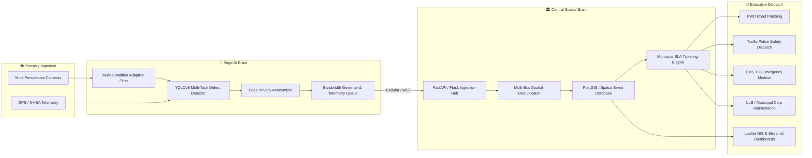

# 🧠 BRAIN.MD: MASTER TECHNICAL BLUEPRINT & COGNITIVE ARCHITECTURE
## Smart India Hackathon (SIH) — Problem Statement 26124 / 24124
### AI-Powered Mobile Urban Intelligence Platform Using Public Transport Fleet
**Team**: Digital Nomads | **Role**: System Architectural Core & Intelligence Specification

---

## Executive Summary & System Vision
Traditional municipal urban infrastructure monitoring relies on manual road inspections, sporadic citizen complaints, and expensive survey vehicles that cover only a fraction of city roads once or twice a year. 

**The Brain of this Platform** revolutionizes urban governance by converting existing, daily-operating public transit buses (e.g., BMTC, DTC, BEST) into **autonomous mobile spatial sensing units**. As buses travel their scheduled corridors, onboard edge AI nodes continuously inspect the urban environment, detect road surface hazards, calculate traffic density, preserve citizen privacy, deduplicate sightings across multiple vehicles, and dispatch automated work-order tickets directly to the responsible municipal departments.



---

## 1. Multi-Layer Cognitive Architecture (The "Brain" Metaphor)

The platform functions as a distributed cyber-physical nervous system partitioned into five cognitive tiers:

```
+-------------------------------------------------------------------------+
|                  5. ACTION & DISPATCH LAYER (Cerebellum)                |
|  PWD Maintenance | Police Dispatch | EMS 108 Medical | Municipal Corp   |
+-------------------------------------------------------------------------+
                                    ▲
+-------------------------------------------------------------------------+
|              4. CEREBRAL FUSION & REASONING LAYER (Cerebrum)            |
|  25m Spatial Clustering | Deduplication | SLA Rules | Work-Order Engine |
+-------------------------------------------------------------------------+
                                    ▲
+-------------------------------------------------------------------------+
|             3. SYNAPTIC TRANSMISSION LAYER (Nervous Pathways)           |
|  Cellular 4G/5G Alerts (<1.5MB/hr) | Store-and-Forward | Depot Broadband|
+-------------------------------------------------------------------------+
                                    ▲
+-------------------------------------------------------------------------+
|               2. REFLEX & COGNITIVE EDGE LAYER (Edge Node)              |
|  Multi-Condition Preprocessing | YOLOv8 Vision | Edge Anonymization     |
+-------------------------------------------------------------------------+
                                    ▲
+-------------------------------------------------------------------------+
|                    1. SENSORY INGESTION LAYER (Sensors)                 |
|  Front / Rear / Curb / Cabin Cameras | Real-Time GPS Telemetry Stream   |
+-------------------------------------------------------------------------+
```

---

## 2. Mathematical Formulations & Algorithms

### 2.1 Multi-Bus Spatial Deduplication (Haversine Spatial Clustering)
When dozens of buses ply the same route, a single pothole could trigger hundreds of duplicate alerts. The central spatial brain uses the **Haversine Great-Circle Distance Metric** to identify and cluster sightings within a spatial tolerance radius of $\mathbf{R_{dedup} = 25\text{ meters}}$ and a temporal sliding window of $\mathbf{\Delta T_{dedup} = 24\text{ hours}}$:

$$\Delta\sigma = 2 \arcsin\left( \sqrt{ \sin^2\left(\frac{\Delta\phi}{2}\right) + \cos(\phi_1)\cos(\phi_2)\sin^2\left(\frac{\Delta\lambda}{2}\right) } \right)$$

$$d = R_{\text{earth}} \cdot \Delta\sigma \quad \text{where } R_{\text{earth}} \approx 6,371,000 \text{ m}$$

#### Deduplication & Fusion Logic:
If an incoming event $E_{\text{new}}(\text{defect}, \phi_2, \lambda_2, t_2)$ matches an existing record $E_{\text{prev}}(\text{defect}, \phi_1, \lambda_1, t_1)$ such that:
$$d \le 25\text{ m} \quad \text{and} \quad |t_2 - t_1| \le 86,400\text{ s} \quad \text{and} \quad E_{\text{new}}.\text{defect} = E_{\text{prev}}.\text{defect}$$

Then:
1. **No new ticket is spawned**.
2. Verification counter increments: $\text{VerificationCount} \leftarrow \text{VerificationCount} + 1$.
3. Reporting fleet set updates: $\text{Buses} \leftarrow \text{Buses} \cup \{\text{bus\_id}\}$.
4. Confidence score converges asymptotically:
   $$C_{\text{fused}} = 1 - (1 - C_{\text{prev}})(1 - C_{\text{new}})$$

---

### 2.2 Cellular Bandwidth Budget Optimization ($<1.5\text{ MB/hour}$)
Cellular IoT SIM charges for municipal fleets require ultra-low data consumption. The platform enforces an strict cellular bandwidth envelope:

$$\text{Data Rate} = \frac{\text{Payload Size} \times \text{Alerts Count}}{\text{Time Period}}$$

- **Telemetry Ping**: Compact JSON payload ($\approx 180 - 240 \text{ bytes}$).
- **Spatial Debouncing**: Repeated detections of the same defect within $4.0\text{ s}$ or $15\text{ m}$ are suppressed on the edge before serialization.
- **Evidence Compression**: Photographic snapshot crops are saved at $640\times 360$ JPEG (quality = 70, size $\approx 25 - 45 \text{ KB}$), transmitted **only** for new high-confidence anomalies ($\text{conf} \ge 0.75$).
- **Theoretical Worst-Case**: 30 defects/hour $\times 40\text{ KB} + 360\text{ pings}\times 0.2\text{ KB} \approx 1.27\text{ MB/hour} < \mathbf{1.5\text{ MB/hour}}$ limit.
- **Nominal Real-World Consumption**: $\mathbf{0.025 \text{ to } 0.35\text{ MB/hour per bus}}$.

---

### 2.3 Environmental Preprocessing Math (Multi-Condition Vision)
To maintain high precision across severe weather, lighting, and camera occlusions:

#### A. Low-Light / Night Enhancement
Converts RGB to CIE-LAB color space and executes Contrast Limited Adaptive Histogram Equalization (CLAHE) exclusively on the luminance ($L^*$) channel:
$$L^*_{\text{enhanced}} = \text{CLAHE}(L^*, \text{clipLimit}=3.0, \text{tileGridSize}=(8,8))$$
$$\text{Output} = \text{LAB2BGR}(L^*_{\text{enhanced}}, a^*, b^*)$$

#### B. Wet Asphalt Glare & Specular Reflection Suppression
Water puddles under direct streetlights produce specular glares mistaken for holes. The edge pipeline measures pixel saturation and luminance in the lower road region of interest (RoI):
$$M_{\text{glare}}(x, y) = \begin{cases} 1 & \text{if } V(x,y) > 230 \text{ and } S(x,y) < 35 \\ 0 & \text{otherwise} \end{cases}$$
Specular regions are dynamically masked from triggering false positive edge gradients.

#### C. Fog / Haze Contrast Recovery
Applies dynamic range histogram stretching across normalized intensity values:
$$I_{\text{stretched}}(x, y) = \frac{I(x, y) - I_{\min}}{I_{\max} - I_{\min}} \times 255$$

---

### 2.4 Traffic Density & Congestion Index ($TCI$)
At every frame sampling interval, the surrounding vehicles are detected and classified:
$$TCI = \sum_{k \in \text{Classes}} w_k \cdot N_k$$
Where weights $w_k$ reflect vehicular road occupancy:
* Car: $w=1.0$
* Motorcycle / Bike: $w=0.5$
* Bus / Heavy Truck: $w=2.5$

$$\text{Congestion Level} = \begin{cases} 
\text{Low} & \text{if } TCI \le 3.0 \\
\text{Medium} & \text{if } 3.0 < TCI \le 8.0 \\
\text{High} & \text{if } TCI > 8.0 
\end{cases}$$

---

## 3. Defect Taxonomy & Municipal Department Routing Matrix

Every defect detected by the AI vision model is automatically classified, prioritized, mapped to a recovery SLA, cost-estimated, and routed to its legal administrative department:

| Defect Class Code | Benchmark Alias | Severity | Routing Agency | SLA Window | Est. Cost (INR) | Primary Corrective Action |
| :--- | :--- | :---: | :--- | :---: | :---: | :--- |
| **`pothole`** | `D40` | **High** | Public Works Dept (PWD) | 48 Hours | ₹4,500 | Cold-mix asphalt patching & compaction |
| **`damaged_pavement`** | `D00/D10/D20` | **Medium** | Public Works Dept (PWD) | 72 Hours | ₹12,000 | Milling and surface re-layering |
| **`crash`** | Incident | **Critical** | City Traffic Police | 1 Hour | ₹0 | Emergency police dispatch & accident clearance |
| **`accident_hazard`**| Incident | **Critical** | City Traffic Police | 2 Hours | ₹0 | Immediate traffic redirection & road clearance |
| **`medical_emergency`**| Incident | **Critical** | EMS 108 Ambulance | 1 Hour | ₹0 | Immediate trauma ambulance dispatch |
| **`waterlogging`** | Urban Puddle | **High** | Municipal Corp (BBMP/ULB) | 24 Hours | ₹8,500 | Drain suction pump deployment |
| **`damaged_road_divider`**| Hazard | **High** | Municipal Corp (BBMP/ULB) | 48 Hours | ₹16,000 | Reinstall reinforced concrete median blocks |
| **`missing_zebra_crossing`**| `D44` | **Medium** | Municipal Corp (BBMP/ULB) | 120 Hours| ₹3,500 | Reflective thermoplastic paint renewal |
| **`damaged_traffic_sign`**| Regulatory | **Medium** | City Traffic Police | 72 Hours | ₹2,800 | Mount microprismatic reflective signboard |

---

## 4. Database Architecture & Schema Blueprint

The central data store uses **Spatial SQLite (with SpatiaLite / PostGIS compatibility)** to manage spatial events, fleet telemetry, and automated tickets.

### 4.1 Database Tables (`urban_intelligence_spatial.db`)

#### 1. Table `events` (Spatial Defect & Hazard Records)
```sql
CREATE TABLE IF NOT EXISTS events (
    event_id TEXT PRIMARY KEY,
    defect_type TEXT NOT NULL,
    defect_name TEXT NOT NULL,
    category TEXT NOT NULL,
    severity TEXT NOT NULL,
    confidence REAL NOT NULL,
    latitude REAL NOT NULL,
    longitude REAL NOT NULL,
    bus_id TEXT NOT NULL,
    route_id TEXT NOT NULL,
    camera_angle TEXT NOT NULL,
    department TEXT NOT NULL,
    sla_hours INTEGER NOT NULL,
    estimated_cost_inr INTEGER NOT NULL,
    action_required TEXT NOT NULL,
    snapshot_path TEXT,
    verification_count INTEGER DEFAULT 1,
    reporting_buses TEXT,
    ticket_id TEXT,
    status TEXT DEFAULT 'OPEN',
    created_at TIMESTAMP DEFAULT CURRENT_TIMESTAMP,
    updated_at TIMESTAMP DEFAULT CURRENT_TIMESTAMP
);
CREATE INDEX IF NOT EXISTS idx_events_lat_lon ON events(latitude, longitude);
CREATE INDEX IF NOT EXISTS idx_events_status ON events(status);
```

#### 2. Table `tickets` (Municipal Work Orders)
```sql
CREATE TABLE IF NOT EXISTS tickets (
    ticket_id TEXT PRIMARY KEY,
    event_id TEXT NOT NULL,
    department TEXT NOT NULL,
    defect_type TEXT NOT NULL,
    severity TEXT NOT NULL,
    priority TEXT NOT NULL,
    sla_hours INTEGER NOT NULL,
    estimated_cost_inr INTEGER NOT NULL,
    action_required TEXT NOT NULL,
    latitude REAL NOT NULL,
    longitude REAL NOT NULL,
    bus_id TEXT NOT NULL,
    status TEXT DEFAULT 'DISPATCHED',
    created_at TIMESTAMP DEFAULT CURRENT_TIMESTAMP,
    resolved_at TIMESTAMP,
    FOREIGN KEY(event_id) REFERENCES events(event_id)
);
```

#### 3. Table `fleet_telemetry` (Live Fleet GPS Heartbeats)
```sql
CREATE TABLE IF NOT EXISTS fleet_telemetry (
    bus_id TEXT NOT NULL,
    route_id TEXT NOT NULL,
    latitude REAL NOT NULL,
    longitude REAL NOT NULL,
    speed_kmh REAL NOT NULL,
    heading_deg REAL NOT NULL,
    congestion_level TEXT NOT NULL,
    vehicle_count INTEGER NOT NULL,
    timestamp TIMESTAMP DEFAULT CURRENT_TIMESTAMP,
    PRIMARY KEY(bus_id, timestamp)
);
```

---

## 5. Network Protocol & Inter-Process Communication (IPC)

The platform runs as a collaborative ecosystem of decoupled services communicating over HTTP REST, WebSockets, and asynchronous queues:

```
[Edge Sensing Pipeline]
        │
        ├── (HTTP POST /events) ──────────────────────────► [Flask REST Server (Port 5000)]
        │                                                           │
        │                                                           ├──► Leaflet.js Web GIS
        │                                                           └──► Spatial SQLite DB
        │
        ├── (WebSocket ws://127.0.0.1:8000/ws/live_feed) ─► [FastAPI Central Hub (Port 8000)]
        │                                                           │
        │                                                           ├──► Live HUD Stream
        │                                                           └──► Swagger /docs
        │
        └── (Store & Forward Local Buffer) ───────────────► [Depot Wi-Fi Sync (/api/depot/sync)]
```

### Core API Endpoints:
* `GET /events` — Fetch recent spatial alerts with configurable limits and department filters.
* `GET /events/heatmap` — Returns weighted `[lat, lon, intensity]` points for instant GIS heatmap rendering.
* `POST /events` — Ingestion endpoint for incoming edge alert payloads.
* `POST /events/reset` — Atomically clears all test data, resets tickets, and purges spatial records for clean demonstration.
* `GET /analytics` — Real-time analytics payload (total defects, tickets by agency, estimated budget in INR, fleet count).
* `WS /ws/live_feed` — Real-time telemetry and augmented video HUD frames streamed to dashboard clients.

---

## 6. Execution Modes & Hardware Compatibility

The Edge Sensing Pipeline (`model/edge_sensing.py`) is engineered with dynamic source polymorphism:

```bash
# 1. Standard Simulation Mode (Synthetic 720p Urban Route)
python model/edge_sensing.py --source demo

# 2. Built-in Laptop / USB Webcam (Direct road or screen inspection)
python model/edge_sensing.py --source 0

# 3. Wireless Smartphone Transit Camera (IP Webcam / RTSP Stream)
python model/edge_sensing.py --source http://192.168.1.15:8080/video

# 4. Custom Pre-Recorded Dashcam Video (.mp4 / .avi / .mkv)
python model/edge_sensing.py --source /path/to/dashcam_video.mp4
```

### Hardware Deployment Profiles:
| Hardware Target | Compute Node Type | Resolution & FPS | Inference Backend | Model Checkpoint |
| :--- | :--- | :---: | :--- | :--- |
| **Development Laptop** | Intel i5/i7 / Apple Silicon | 720p @ 30 FPS | PyTorch CPU / MPS | `urban_defects_yolov8.pt` |
| **Vehicle Edge Box** | NVIDIA Jetson Orin Nano / AGX | 1080p @ 45 FPS | TensorRT (FP16/INT8) | `urban_defects_yolov8.engine` |
| **Low-Cost Fleet Box**| Raspberry Pi 5 + Hailo-8 NPU| 720p @ 30 FPS | HailoRT / ONNX Runtime | `urban_defects_yolov8.hef` |

---

## 7. Edge Privacy, Security & Resilience (Zero-Trust)

### 7.1 On-Device Anonymization Engine (`EdgeAnonymizer`)
To comply with global and national data privacy regulations (e.g., India DPDP Act 2023, GDPR), **no unblurred human faces or identifiable license plates are ever transmitted over the network or written to disk**.
* A real-time Haar Cascade / lightweight detector detects face and license plate coordinates on the raw frame buffer.
* An aggressive Gaussian Blur kernel ($31 \times 31, \sigma = 15$) is applied strictly over the detected RoI before saving snapshot artifacts.

### 7.2 Store-and-Forward Resilient Disk Buffer (`StoreAndForwardQueue`)
Public buses frequently travel through cellular blind spots (underground tunnels, metro underpasses, dense overpasses).
* If an HTTP transmission fails due to network outage, the event is immediately appended to `dataset/data/alerts/edge_offline_queue.json`.
* An asynchronous background daemon polls every $3.0\text{ s}$. As soon as connectivity returns, buffered alerts are dequeued and transmitted in FIFO order with zero data loss.

---

## 8. Summary of Innovation for Hackathon Evaluation

| Evaluation Metric | Conventional Inspection Methods | SIH 26124 AI Platform ("The Brain") |
| :--- | :--- | :--- |
| **Inspection Frequency** | Once every 6 to 12 months | **Continuous Daily Sweeps** (every bus trip) |
| **Cost per Kilometer** | High (Dedicated survey teams & lidar vans) | **Near-Zero** (Utilizes existing public transit buses) |
| **Detection Speed** | Days to weeks | **Real-Time Sub-Second Detection (<300ms)** |
| **Reporting Accuracy** | Subjective human estimation | **Standardized Deep Learning Vision (YOLOv8)** |
| **Ticket Dispatch** | Manual paperwork and office delays | **Instant Automated Multi-Agency SLA Ticketing** |
| **Deduplication** | Redundant contractor work orders | **Automated 25m / 24h Spatial Deduplication** |
| **Privacy Compliance**| Full raw video stored | **Edge Anonymization (Faces & Plates Blurred)** |
| **Cellular Cost** | Prohibitive video streaming | **<1.5 MB/hour ultra-low bandwidth budget** |

---
*Authored for the Smart India Hackathon Prototype Suite — Team Digital Nomads (PS 26124 / 24124).*
